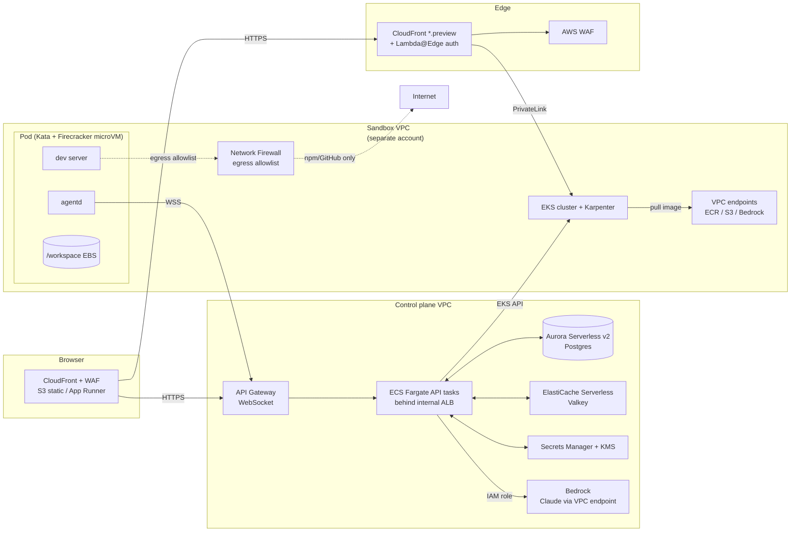

# PM Sandbox — Enterprise / Full-AWS Variant

**Companion to** `pm-sandbox-spec.md` — same product, every component mapped onto AWS-native services with the controls a regulated enterprise actually demands: VPC isolation, KMS-managed keys, SAML SSO, in-region LLM, full audit trail, multi-AZ HA, and hard tenant isolation between sandboxes.

**When to use this:** internal platform inside a company with compliance scope (SOC 2, HIPAA, ISO 27001, FedRAMP-adjacent), a security review board, an existing AWS landing zone, and an "all data stays in AWS" mandate.

**Indicative monthly run-rate:** **~$1,800–$3,500/mo baseline** (control plane + idle infra), plus **~$0.10–$0.40/sandbox-hour** of compute, plus **Bedrock token spend** (typically the largest line for active use). See §10.

---

## 1. Component swap table

| Reference (`pm-sandbox-spec.md`) | Enterprise AWS swap | Why |
|---|---|---|
| Next.js on Vercel | **CloudFront + S3** static export, OR **App Runner** for SSR | Stays inside AWS; CloudFront integrates with WAF |
| Fastify API | **ECS Fargate** behind **internal ALB**, fronted by **CloudFront + WAF** | Fargate = no EC2 to patch; ALB does WS termination |
| Browser ↔ API WebSocket | **API Gateway WebSocket APIs** (alt: ALB WS) | Native auth, throttling, CloudWatch metrics |
| Postgres (Neon) | **Aurora Serverless v2 PostgreSQL** (multi-AZ, KMS-encrypted) | Auto-scales, point-in-time restore |
| Upstash Redis | **ElastiCache Serverless for Valkey** | Same API as Redis, Amazon-supported |
| Fly Machines (sandbox runtime) | **EKS + Karpenter** with **Kata Containers (Firecracker hypervisor)** for per-pod microVM isolation | True VM-level tenant isolation; AWS's own pattern |
| Custom `agentd` | Same custom binary, packaged as container | Unchanged |
| Anthropic Claude API | **Amazon Bedrock** — Claude (cross-region inference profile) | In-region, KMS, no third-party data egress |
| Cloudflare Worker proxy + DO | **CloudFront + Lambda@Edge** for routing → **internal NLB → ALB** with host-based rules to sandbox pods | Wildcard routing, WAF, full VPC integration |
| Wildcard cert (Cloudflare) | **ACM** wildcard cert (free, auto-rotating) | Pinned to CloudFront + ALB |
| GitHub App | Same — but with **PrivateLink to GitHub Enterprise Cloud** for control-plane traffic | Keeps repo cloning off the public internet |
| Auth.js + GitHub OAuth | **Cognito User Pool** federated to corporate IdP via SAML / OIDC (Okta, Azure AD, Ping) | SSO, MFA, JIT provisioning |
| LLM API key | **No keys** — IAM role on the API task assumes a Bedrock-invoke role | Eliminates a class of leak |
| Sentry / Datadog | **CloudWatch Logs + X-Ray** baseline; **Datadog/New Relic via PrivateLink** if mandated | No public egress |
| GitHub Actions CI | **CodePipeline + CodeBuild** with **ECR** image scanning + **Inspector** | Compliance-friendly |
| Container registry | **Amazon ECR** with image signing (Notary v2) and replication | Required for image provenance |
| Secrets / tokens | **Secrets Manager** + **KMS CMKs** | Rotation, audit, customer-managed keys |
| Observability | CloudWatch + X-Ray + **OpenSearch** for log analytics | Standard enterprise pattern |
| Compliance / audit | **CloudTrail** (org-wide), **GuardDuty**, **Security Hub**, **Config**, **AWS Backup**, **Macie** for the egress S3 bucket | Evidence packages for auditors |
| Network controls | **VPC** with private-only subnets for sandboxes, **AWS Network Firewall** with egress allowlist (npm, GitHub, Bedrock VPC endpoint, ECR), **VPC endpoints** for S3/ECR/Bedrock/Secrets Manager | No NAT egress for AWS service calls; explicit allowlist for npm |

---

## 2. Architecture



### Two-account topology (recommended)

- **Account A — control plane.** API, DB, cache, Cognito, Bedrock invocations, Secrets Manager, all observability.
- **Account B — sandbox runtime.** EKS, Karpenter, Network Firewall, sandbox EBS volumes, ECR replicas. No production data ever lands here; this account is the blast-radius boundary.

Cross-account: API in A talks to EKS API in B via an IAM role (`AssumeRole` with a session duration of 15 min). CloudFront in the edge tier reaches sandbox pods in B via **VPC Lattice** or **PrivateLink** — never the public internet.

---

## 3. Sandbox isolation — the load-bearing decision

Three options, ranked by isolation strength:

| Option | Isolation | Startup | Density | Recommended |
|---|---|---|---|---|
| Fargate task per sandbox | Process + cgroup, shared kernel within task | ~30 s | Low | ❌ — too slow |
| EKS pod with **gVisor** (`runsc`) | Userspace syscall filter | ~3 s | High | ⚠️ — fine for trusted code |
| **EKS pod with Kata Containers (Firecracker)** | **Per-pod microVM, separate guest kernel** | **~5 s** | Medium | ✅ **Default** |
| Per-sandbox EC2 (Karpenter spins one node per pod) | Hardware VM | ~45 s | 1 pod/node | Only for special workloads |

Why Kata + Firecracker:

- Each sandbox pod gets its own kernel — kernel exploits don't cross tenants.
- AWS uses Firecracker for Lambda and Fargate. The pattern is battle-tested at AWS scale.
- Boot under 5 s on `c7g.xlarge`-class nodes thanks to pre-booted Firecracker pools (configure Karpenter `nodepool` with `consolidationPolicy: WhenEmpty` and a `disruption.budget` to keep ~2 warm spare nodes).
- Compatible with vanilla Kubernetes manifests — set `runtimeClassName: kata-fc` on the pod and you're done. No application-level code changes from the reference spec.

Run two RuntimeClasses in the cluster: `runc` for the platform itself (cluster-autoscaler, Karpenter, observability agents) and `kata-fc` for sandbox pods only.

---

## 4. Network isolation

```
                       ┌────────────────────────────┐
                       │ Sandbox VPC (account B)    │
                       │                            │
  Internet ── CloudFront ──── ALB (public)          │
            (WAF, Shield)      │                    │
                               │ via VPC Lattice    │
                               ▼                    │
                          ┌───────────┐             │
                          │ EKS pods  │             │
                          │ (kata-fc) │             │
                          └─────┬─────┘             │
                                │ all egress        │
                                ▼                   │
                          ┌──────────────┐          │
                          │ AWS Network  │          │
                          │ Firewall     │          │
                          │ allowlist:   │          │
                          │ - registry.* │          │
                          │ - github.com │          │
                          │ - npmjs.org  │          │
                          │ - api.bedrock│          │
                          └──────┬───────┘          │
                                 │                  │
                       ┌─────────┴────────────┐     │
                       │ NAT (allowlisted)    │     │
                       └──────────────────────┘     │
                       ┌──────────────────────┐     │
                       │ VPC endpoints (no NAT│     │
                       │ for AWS services)    │     │
                       │ - bedrock-runtime    │     │
                       │ - ecr.api / .dkr     │     │
                       │ - s3 (gateway)       │     │
                       │ - secretsmanager     │     │
                       └──────────────────────┘     │
                       └────────────────────────────┘
```

Default-deny egress in Network Firewall. Maintain the allowlist as code in Terraform; reviews go through PR. PMs can request domain additions, security signs them off in the diff.

---

## 5. LLM via Bedrock

- Use **Bedrock cross-region inference profiles** for Claude (`us.anthropic.claude-sonnet-4-20250514-v1:0` style) — gives capacity across multiple regions while keeping the request inside AWS.
- VPC endpoint for `bedrock-runtime` in the control-plane VPC: API tasks call Bedrock without traversing the public internet.
- IAM role for the API tasks scopes access to one foundation model and one `inferenceProfile`. Per-PM cost guardrails enforced via **Bedrock Application Inference Profiles** (one profile per cost center, tagged) so Cost Explorer shows attribution.
- **Bedrock Guardrails** wrap every invocation: PII redaction inbound/outbound, prompt-injection detection, denied topics. Cheaper than building it yourself, gives auditors a checkbox.
- **Bedrock model invocation logging** to S3 (KMS-encrypted, Object Lock for retention). Retention policy matches your audit requirements.

The agent loop logic from §6 of the reference spec is unchanged — only the SDK call swaps:

```ts
// before: anthropic.messages.create(...)
// after:
const r = await bedrock.converseStream({
  modelId: process.env.BEDROCK_INFERENCE_PROFILE_ARN,
  messages, system, toolConfig: { tools: TOOL_SCHEMAS },
  guardrailConfig: { guardrailIdentifier: GR_ID, guardrailVersion: "DRAFT" },
});
```

---

## 6. Auth — SSO + IAM stitched together

| Boundary | Mechanism | Notes |
|---|---|---|
| Browser ↔ Cognito | SAML / OIDC federation to corporate IdP | MFA enforced upstream by IdP |
| Cognito → API | Cognito JWT in `Authorization: Bearer` | Verified at API Gateway with built-in authorizer |
| API → AWS services (Bedrock, EKS, S3, Secrets Manager) | IAM role on the Fargate task definition | No long-lived AWS keys anywhere |
| API → GitHub (App) | App private key in **Secrets Manager**, decrypted via KMS, mints `ghs_…` per call | Rotate App private key annually via IaC |
| API ↔ agentd (in pod) | `VM_JWT` signed with **KMS asymmetric key** (RSASSA-PSS) | KMS verifies on agentd boot via signed JWT validator container; no shared HMAC secrets to leak |
| Browser ↔ preview (`*.preview.app`) | Signed cookie issued by API after Cognito session check | Cookie scoped to `sandbox_id` and `user_id`; verified at Lambda@Edge before the request hits the ALB |

The big win over the reference: **no application secret exists for VM_JWT signing**. KMS holds the private key, never releases it, and signs on demand. Compromising the API role gets you the ability to sign tokens for the duration of the credential — but not the key itself, and CloudTrail logs every signature.

---

## 7. Data & secrets

- **Aurora Serverless v2** (Postgres 16): min 0.5 ACU, max 4 ACU. Multi-AZ with 1 reader. Backups to S3 (KMS-encrypted) for 35 days. Cross-region replica if your DR RPO requires it.
- **ElastiCache Serverless Valkey**: min 1 GB, encryption in transit + at rest with CMK.
- **Secrets Manager** for: GitHub App private key, Bedrock model IDs, internal HMAC for legacy APIs. Rotation Lambdas where applicable.
- **KMS**: one CMK per data class (`pm-sandbox/db`, `pm-sandbox/secrets`, `pm-sandbox/jwt-signing`, `pm-sandbox/audit-logs`). Rotation enabled on all.
- **Sandbox EBS volumes**: gp3, 20 GB per pod, KMS-encrypted with `pm-sandbox/sandbox-fs` CMK. Deleted on pod termination (`reclaimPolicy: Delete`).

---

## 8. Observability & audit (the auditor checklist)

| Requirement | Service | Setup |
|---|---|---|
| Org-wide API audit | CloudTrail | Multi-region trail, S3 with Object Lock |
| Network/host threats | GuardDuty | Enabled in both accounts |
| Resource compliance | AWS Config | Conformance pack: NIST 800-53, CIS AWS Foundations |
| Centralized findings | Security Hub | Aggregates GuardDuty + Inspector + Macie |
| Image vulnerabilities | ECR Enhanced Scanning + Inspector | Block deploy on critical CVEs in CodePipeline |
| Sensitive data scan | Macie | On the Bedrock invocation log bucket |
| App logs | CloudWatch Logs → OpenSearch via subscription filter | 90-day hot, 1-year cold (S3 + Glacier) |
| Distributed tracing | X-Ray | Auto-instrument Fargate API + agentd outbound |
| LLM auditability | Bedrock model-invocation logging → S3 | Required for many AI risk policies |
| Backup | AWS Backup | Aurora + EBS, daily, 35-day retention |
| Access reviews | IAM Access Analyzer + IAM Identity Center | Quarterly access cert |

Every PM action ends up in an `audit_log` row in Aurora **and** a CloudTrail event for the AWS-side action it triggered (e.g. `eks:CreateNodepool`, `bedrock:InvokeModel`). Auditors get one query: PM → user_id → events.

---

## 9. CI/CD pipeline

```
PR opened → CodeBuild (test + lint + sbom + sign)
          → ECR push (Account B replica via cross-account replication)
          → Inspector scan
          → if pass: CodeDeploy blue/green to Fargate API
          → ArgoCD/Flux reconciles EKS manifests for the new sandbox image
```

- ECR images signed with Notary v2; EKS admission controller (e.g. **Kyverno**) refuses unsigned images. Required for SLSA L3 evidence.
- Helm charts, Terraform, RuntimeClasses, NetworkPolicies all live in a single GitOps repo. Production change = PR + 2 reviewers + Atlantis plan.

---

## 10. Cost model — concrete

Baseline (control plane running 24/7, no sandbox activity):

| Item | Config | Monthly |
|---|---|---|
| Aurora Serverless v2 | 0.5 ACU avg, 100 GB, multi-AZ | ~$120 |
| ElastiCache Serverless Valkey | 1 GB avg | ~$80 |
| Fargate API (2 tasks × 1 vCPU/2 GB, 24/7) | | ~$70 |
| API Gateway WebSocket | 10M msgs, 100 GB | ~$50 |
| ALB (2 internal + 1 public) | | ~$60 |
| CloudFront + WAF | 50 GB egress, 5M req | ~$40 |
| Route 53 + ACM | 1 zone, 1 wildcard | ~$5 |
| EKS control plane | 1 cluster | $73 |
| Karpenter idle (2 warm `c7g.large` spares) | | ~$100 |
| Network Firewall | 1 endpoint, low TPS | ~$400 |
| NAT Gateway (one AZ for non-allowlisted egress) | | ~$35 + per-GB |
| VPC endpoints (Bedrock, ECR, S3, Secrets, KMS) | ~6 endpoints × 2 AZ | ~$90 |
| KMS CMKs (4) + key usage | | ~$5 |
| GuardDuty + Config + Security Hub + Inspector | small org | ~$200 |
| CloudWatch + X-Ray + OpenSearch (small) | | ~$200 |
| AWS Backup | 100 GB | ~$10 |
| Cognito | <50k MAU | $0 (free tier) |
| **Baseline subtotal** | | **~$1,540/mo** |

Per active sandbox-hour:

| Item | Cost |
|---|---|
| Karpenter-provisioned `c7g.xlarge` shared by ~6 sandbox pods | ~$0.07/h ÷ 6 = ~$0.012/sandbox-h |
| 20 GB gp3 EBS for `/workspace` | ~$0.0028/h |
| Cross-AZ traffic (small) | ~$0.005/h |
| ECR pull (cached) | negligible |
| CloudWatch logs ingest | ~$0.01/h |
| **Per sandbox-hour subtotal** | **~$0.03–$0.05** |

LLM (Bedrock Claude Sonnet 4) per active turn: ~$0.05–$0.30 depending on context length. A 20-turn session lands at **$1–$5 of LLM** usually dominating compute cost.

A 50-PM team running ~4 hours/PM/business-day: **~$3,500/mo all-in** at steady state.

---

## 11. Multi-tenancy model

For a single enterprise running this internally, *PM* is the tenant boundary. For a SaaS selling to multiple enterprises, add:

- **Per-customer AWS account** (sandbox VPC) provisioned via **Control Tower Account Factory**. Hardest isolation, simplest blast-radius story for sales/legal.
- Or **per-customer EKS namespace + NetworkPolicy + ResourceQuota + dedicated nodepool with `customer=` taint**. Cheaper, weaker boundary.

Cognito → Identity Center groups → IAM roles tagged with `customer_id`. ABAC throughout (`aws:PrincipalTag/customer_id` matches `aws:ResourceTag/customer_id`).

---

## 12. Compliance evidence packages

You need these regardless of variant if you're going through audit; this stack makes them trivial:

- **SOC 2:** CloudTrail + Config conformance pack + IAM Access Analyzer reports + AWS Backup proof.
- **HIPAA:** BAAs in place for AWS services used (Aurora, S3, KMS, Bedrock, ECS, EKS — verify Bedrock for the specific model you pick), encryption-at-rest CMKs, encryption-in-transit ALB + ACM.
- **ISO 27001:** Security Hub conformance pack + asset inventory from Config.
- **FedRAMP-aligned (not authorized):** Use GovCloud regions; substitute Cognito → IAM Identity Center.

For the LLM piece specifically, regulated buyers will ask: *"Is our prompt or code used to train the model?"* Bedrock's standing answer is **no**. Have a one-pager ready.

---

## 13. Migration path back to the reference spec

- Aurora → Neon Postgres: standard `pg_dump` → restore.
- Bedrock → Anthropic API: swap one SDK call.
- EKS + Kata → Fly Machines: rewrite the orchestrator wrapper (~200 LOC).
- Cognito → Auth.js: SAML stays; reconfigure the IdP relying party.
- CloudFront + Lambda@Edge → Cloudflare Worker + DO: same routing logic, different runtime.

The application code (agent loop, tool registry, web UI, agentd) is unchanged. Everything that differs is infrastructure and IAM — which is the right place for the differences to live.

---

## 14. Footguns specific to this stack

1. **Kata + Firecracker on EKS requires bare-metal nodes or specific instance families.** Use `c7g.metal` / `m7g.metal` for ARM, or `c6i.metal` / `m6i.metal` for x86. Karpenter must explicitly request these — they cost more than non-metal but are the only way Kata gets KVM access.
2. **Bedrock cross-region inference profiles cost the same as the model's home region**, but capacity is much better. Always use them for production agent traffic.
3. **AWS Network Firewall is ~$400/mo minimum** even idle. If that's a problem, use **VPC route-table-based egress** with a NAT into a small Squid proxy on EC2 — uglier, ~$30/mo, weaker controls.
4. **API Gateway WebSocket has a hard 10-min idle timeout and a 2-h max connection.** Build heartbeat + reconnect into the browser client and `agentd` from day one.
5. **EKS upgrades break Kata RuntimeClass installs unless you pin the operator.** Treat the Kata operator as a first-class upgrade gate; test in a staging cluster.
6. **Bedrock Guardrails latency adds ~200–600 ms per call.** If your agent is chatty (many small tool-calls), batch results back to the LLM in fewer turns.
7. **Cross-account log aggregation is annoying.** Use **CloudWatch Logs cross-account sharing** (organization-level) so the security account owns the logs from day one.
8. **Image signing breaks any "quick fix" deploy.** That's the point — but make sure your incident runbook has an emergency-deploy path through CodePipeline (not `kubectl set image`).

---

## 15. Variant decision matrix

| If you... | Pick |
|---|---|
| Are one person prototyping | **Hobbyist** (`pm-sandbox-hobbyist.md`) |
| Are a startup serving up to ~50 PMs across <10 customers | **Reference** (`pm-sandbox-spec.md`) |
| Sell to regulated enterprises, or your own company is regulated | **This document** |
| Need on-prem / air-gapped | This document, swapping Bedrock for vLLM on EKS, EKS for OpenShift, Cognito for Keycloak. The shape of the architecture survives. |
