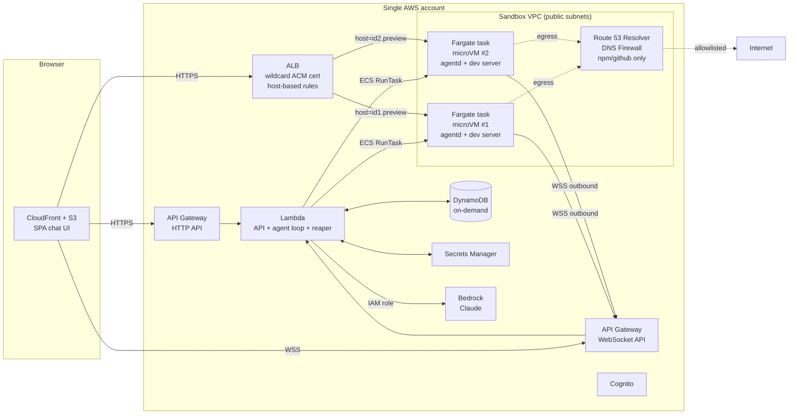

# PM Sandbox — AWS Variant

**Companion to** `pm-sandbox-spec.md` — same product, mapped onto AWS-native services.

This doc has **two tiers**:

- **§1–§11 Lean tier** — target **~$100/mo** for a small team (~10 PMs × ~10 h/week each, ~430 sandbox-hours/month). Default for v1.
- **§12 Production / compliance upgrade** — what to add on top when usage grows or you take on SOC 2 / HIPAA / regulated customers (~$1,800–$3,500/mo baseline).

The lean tier still gives you **VM-level sandbox isolation, in-region LLM, KMS-encrypted data, IAM-only access, audit trail** — the things that make this "enterprise" rather than "hobbyist". It strips out everything that's *only* there for scale or compliance evidence.

---

## 1. The single decision that makes lean possible

**Use ECS Fargate as the sandbox runtime, not EKS + Kata.**

Every Fargate task runs in its own Firecracker microVM with a separate guest kernel. That's the same isolation model as the heavyweight EKS+Kata design — AWS uses Firecracker to keep its own customers separated. By choosing Fargate, you inherit microVM isolation without paying for an EKS cluster ($73/mo flat), Karpenter, bare-metal nodes, the Kata operator, or AWS Network Firewall.

The remaining lean choices follow from that:

- No EKS → no kubectl, no Helm, no GitOps reconciler. ECS RunTask is the entire orchestrator.
- No Network Firewall → use **Route 53 Resolver DNS Firewall** (~$0.50/mo per VPC + $0.40/M queries) for egress allowlist.
- No NAT Gateway → run sandbox tasks in **public subnets with public IPs**, lock down inbound via security groups (only ALB SG can hit the dev port).
- No Aurora → **DynamoDB on-demand** for everything. The data model fits trivially (small docs, key access patterns).
- No ElastiCache → DynamoDB handles session state too.
- No 24/7 Fargate API → **Lambda + API Gateway HTTP/WebSocket APIs**, scales to zero.
- No CloudFront for the preview path → **single ALB** with a wildcard ACM cert and per-sandbox host-based listener rules.

---

## 2. Component map (vs the reference spec)

| Reference (`pm-sandbox-spec.md`) | Lean AWS swap | Why |
|---|---|---|
| Next.js on Vercel | **S3 + CloudFront** static export of the SPA | $1–2/mo at this scale |
| Fastify API | **Lambda** (Node 22) behind **API Gateway HTTP API** | Scales to zero, pay per request |
| Browser ↔ API WebSocket | **API Gateway WebSocket APIs** | Native auth, $1/M msgs, $0.25/M conn-mins |
| Postgres + Drizzle | **DynamoDB on-demand** + electrodb (or single-table) | Free tier covers a small team |
| Upstash Redis | **DynamoDB** with TTL on session items | One less service to run |
| Fly Machines (sandbox) | **ECS Fargate (Graviton)** — one task per sandbox, microVM isolation built in | $0.02/h per sandbox |
| Custom `agentd` | Same custom binary, packaged as Fargate-compatible image | Unchanged |
| Anthropic Claude API | **Amazon Bedrock — Claude** (cross-region inference profile) | In-region, IAM-scoped, no third-party data egress |
| Cloudflare Worker proxy + DO | **ALB** with wildcard cert + per-sandbox host-based listener rules | Native WS upgrade, no extra service |
| Wildcard cert (Cloudflare) | **ACM** wildcard cert (free, auto-rotating) | Pinned to the ALB |
| GitHub App | Same. Private key in **Secrets Manager** | $0.40/mo per secret |
| Auth.js + GitHub OAuth | **Cognito User Pool** + GitHub OAuth IdP federation | Cognito free up to 50k MAU |
| Sentry / Datadog | **CloudWatch Logs** with 14-day retention | $1–3/mo at this scale |
| Container registry | **Amazon ECR** | $0.10/GB/mo for one image |
| Secrets / tokens | **Secrets Manager** + **KMS (default AWS-managed key)** | Drop CMKs at lean tier |
| Observability | CloudWatch metrics + Logs Insights | Built-in |
| Compliance / audit | **CloudTrail management events** (free) | Add Config/GuardDuty/Security Hub at upgrade tier |
| Network controls | **Public subnets** + tight security groups + **Route 53 Resolver DNS Firewall** for egress allowlist | $1–5/mo vs Network Firewall's $400 |

---

## 3. Architecture



Topology: **one VPC, one account.** The sandbox subnets are public (saves the NAT Gateway), but inbound is locked at the security-group level: dev-server ports accept traffic only from the ALB's security group. The agent's outbound WS to API Gateway and outbound `git`/`npm` traffic are unaffected.

---

## 4. Sandbox lifecycle

```
PM clicks "Start sandbox"
  ↓
Lambda receives POST /sandboxes
  ↓
Mints VM_JWT (HS256, secret in Secrets Manager)
Mints GitHub installation token via @octokit/auth-app
  ↓
ecs.RunTask({
  taskDefinition: "pm-sandbox:current",
  launchType: "FARGATE",
  platformVersion: "LATEST",
  networkConfiguration: { awsvpcConfiguration: {
    subnets: PUBLIC_SUBNETS,
    securityGroups: [SANDBOX_SG],
    assignPublicIp: "ENABLED",
  }},
  overrides: { containerOverrides: [{ name: "agentd", environment: [
    { name: "VM_JWT", value: jwt },
    { name: "GITHUB_TOKEN", value: ghToken },
    { name: "REPO_URL", value: repoUrl },
    { name: "REPO_BRANCH", value: branch },
    { name: "CONTROL_WS_URL", value: WSS_URL },
    { name: "SANDBOX_ID", value: id },
  ]}]},
  enableExecuteCommand: false,   // disable ECS Exec — agent is the only entry point
})
  ↓
Lambda writes sandboxes/{id} to DynamoDB (status=provisioning)
  ↓
EventBridge ECS Task State Change → Lambda hook
  ↓ (when task reaches RUNNING)
Lambda reads task ENI → public IP
Lambda calls elbv2.CreateTargetGroup + RegisterTargets({IP})
       + CreateRule({host: "<id>.preview.app", target: TG})
Lambda writes status=running, public_ip, target_group_arn to DynamoDB
  ↓
agentd inside task dials WSS_URL with Bearer VM_JWT
  ↓ (PM can now chat and click Preview)
```

**Cold start:** Fargate Graviton task to RUNNING is ~25–35 s. Show a stepper UI: `provisioning → cloning repo → ready`. Drive the third step from agentd's first idle ping.

**Reaper:** EventBridge Scheduler invokes a Lambda every 5 min. Query DynamoDB for `last_active_at < now() - 30 min`, then for each: `ecs.StopTask`, `elbv2.DeleteRule`, `elbv2.DeleteTargetGroup`, mark stopped. EventBridge ECS Task State Change → STOPPED triggers a final cleanup Lambda for crashed tasks.

---

## 5. Preview routing — single ALB, dynamic rules

```
*.preview.example.com  →  Route 53 alias  →  ALB
                                              │ HTTPS:443 (wildcard ACM cert)
                                              │
                                              ├─ rule: host=id1.preview.* → TG-id1 → 1.2.3.4:5173
                                              ├─ rule: host=id2.preview.* → TG-id2 → 1.2.3.5:5173
                                              └─ default rule: 404
```

- **WebSockets** (Vite HMR) work natively through ALB — no extra config required, just keep `idle_timeout` ≥ 120 s.
- **Auth gate**: ALB has an OIDC action attached to the wildcard listener that bounces unauthenticated requests through Cognito. The browser gets an ALB-managed cookie scoped to the sandbox host. Per-sandbox-user authorization happens in a tiny Lambda authorizer attached as an additional rule action — it reads `sandboxes/{id}` from DynamoDB and rejects if the requester isn't the owner. Cost: ~$0.20/M Lambda invocations.
- **Limit**: ALB allows 100 listener rules per default (soft cap, raise to 500 via support). Each running sandbox = 1 rule + 1 target group. For >100 concurrent, shard across ALBs by id-hash.

---

## 6. Auth & secrets — lean

| Boundary | Lean choice | Notes |
|---|---|---|
| Browser ↔ chat UI | Cognito hosted UI, GitHub OAuth IdP | Free tier covers 50k MAU |
| Cognito → API Gateway | JWT authorizer (built-in) | No code |
| Lambda → AWS services | IAM execution role | No keys anywhere |
| Lambda → GitHub | App private key in **Secrets Manager**, mints `ghs_…` per call, in-process cache | $0.40/mo per secret |
| Lambda ↔ agentd | `VM_JWT` HS256 with secret from Secrets Manager | Skip KMS asymmetric until upgrade tier |
| Browser ↔ ALB preview | ALB OIDC authentication action → Cognito + per-rule Lambda authorizer for ownership check | One auth path, no signed-cookie service |

Total Secrets Manager footprint: 3 secrets (GitHub App private key, VM_JWT signing secret, Bedrock guardrail config) = $1.20/mo.

---

## 7. LLM via Bedrock

- Use **Bedrock cross-region inference profiles** for Claude (e.g. `us.anthropic.claude-sonnet-4-…`) — same price as the home region, much better capacity.
- Lambda execution role allows `bedrock:InvokeModelWithResponseStream` on exactly that one inference profile ARN. Nothing else.
- Skip Bedrock Guardrails at the lean tier (each invocation adds 200–600 ms and a small fee). Add at upgrade tier when you need PII-redaction evidence.
- Skip Bedrock model-invocation logging at lean tier; rely on CloudWatch Logs from the Lambda. Add the S3 + Object Lock pipeline at upgrade tier.

The agent loop logic from §6 of the reference spec is unchanged — only the SDK call swaps:

```ts
// Lambda handler (sketch)
import { BedrockRuntimeClient, ConverseStreamCommand } from "@aws-sdk/client-bedrock-runtime";
const bedrock = new BedrockRuntimeClient({ region: "us-east-1" });
const r = await bedrock.send(new ConverseStreamCommand({
  modelId: process.env.BEDROCK_INFERENCE_PROFILE_ARN,
  messages, system, toolConfig: { tools: TOOL_SCHEMAS },
}));
```

---

## 8. DynamoDB single-table design

One table, on-demand billing. Keys mirror the reference spec's Postgres schema:

```
PK                    SK                          attrs
USER#<uid>            META                        email, name, github_id, created_at
USER#<uid>            INSTALL#<install_id>        account_login, repo_count
SANDBOX#<sid>         META                        status, repo, branch, task_arn, public_ip,
                                                  target_group_arn, rule_arn, last_active_at,
                                                  expires_at, owner_uid (GSI1PK=USER#<uid>)
SANDBOX#<sid>         CONV#<conv_id>              title, created_at
SANDBOX#<sid>         MSG#<conv>#<ts>             role, content_ref (S3 if >100 KB)
SANDBOX#<sid>         TOOLCALL#<msg>#<n>          name, args, result_ref, status, duration_ms
SANDBOX#<sid>         FILECHANGE#<msg>#<path>     change_type, diff_ref
AUDIT#<yyyymm>        EVT#<ts>#<uid>              action, payload_ref
```

GSIs:
- `GSI1` = `byOwner` — `USER#<uid>` → list user's sandboxes.
- `GSI2` = `byIdle` — sparse, populated only for `status=running`, sorted by `last_active_at`. The reaper queries this directly without a scan.

Large blobs (full file contents, big tool results) live in S3 with the DynamoDB item holding only a `s3://...` reference. This is what keeps you under DynamoDB's 400 KB item cap and inside the free tier.

---

## 9. Cost model — concrete <$100/mo

**Assumptions:** 10 PMs, ~10 h/week each = ~430 sandbox-hours/month, ~600 chat turns/month total.

| Item | Config | Monthly |
|---|---|---|
| Fargate (Graviton) sandbox compute | 0.5 vCPU + 1 GB × 430 h | **$8.60** |
| Fargate ephemeral storage | 20 GB included free | $0 |
| ALB | always-on, ~5 LCU avg | **$22** |
| ALB extra LCU (low) | | ~$3 |
| ACM wildcard cert | | $0 |
| Route 53 hosted zone + queries | 1 zone, ~500k queries | ~$1 |
| API Gateway HTTP API | ~50k requests | <$1 |
| API Gateway WebSocket | ~600 conn-hrs, 100k msgs | ~$1 |
| Lambda (API + reaper + authorizer) | ~200k GB-s | <$2 |
| DynamoDB on-demand | ~50k WCUs, 200k RCUs | ~$1 (mostly free tier) |
| S3 (blob refs) | ~5 GB | <$1 |
| CloudFront + S3 SPA | ~5 GB egress, 100k req | ~$1 |
| Cognito | <50k MAU | $0 |
| Bedrock Claude (Sonnet) | ~600 turns × ~6k tokens/turn @ $3/M in + $15/M out | **~$30** |
| Secrets Manager | 3 secrets | ~$1.20 |
| KMS (AWS-managed keys) | | $0 |
| ECR storage | 1 image, ~250 MB | <$0.10 |
| CloudWatch Logs | ~5 GB ingest, 14-day retention | ~$3 |
| CloudTrail management events | | $0 |
| Route 53 Resolver DNS Firewall | 1 rule group, ~1M queries | ~$1 |
| Public IPv4 on Fargate tasks | $0.005/h × 430 h | ~$2.15 |
| Data transfer out (preview HMR + chat) | ~10 GB | ~$0.90 |
| **Total** | | **~$78/mo** |

Headroom for surprises: ~$22/mo before you hit the $100 mark. The biggest swing variable is **Bedrock token spend** — long context windows or talkative agents push it up fast. See §11 for the cost cap mechanism.

---

## 10. Deployment & repo layout

Same monorepo as the reference spec, with these substitutions in `apps/api`:

```
apps/api/
├─ handlers/
│  ├─ http/                 # API Gateway HTTP API → Lambda
│  ├─ ws/                   # API Gateway WebSocket → Lambda ($connect, $disconnect, $default)
│  ├─ ecs-state-change/     # EventBridge → Lambda (task state hooks)
│  └─ reaper/               # EventBridge Scheduler → Lambda (cron)
├─ orchestrator/
│  └─ ecs.ts                # RunTask, StopTask, DescribeTasks
└─ proxy/
   └─ alb-rules.ts          # CreateTargetGroup / CreateRule per sandbox
```

IaC: **AWS CDK** (TypeScript). One stack per environment:

```
infra/cdk/
├─ network-stack.ts         # VPC, subnets, security groups, DNS Firewall
├─ data-stack.ts            # DynamoDB, S3, Secrets Manager, KMS aliases
├─ api-stack.ts             # Cognito, API Gateway, Lambda fns
├─ runtime-stack.ts         # ECS cluster, task definition, ECR, ALB, Route 53
└─ observability-stack.ts   # Log groups, CloudWatch dashboards, alarms
```

CI: **GitHub Actions** with OIDC federation to an IAM role (no long-lived AWS keys in GitHub). One workflow does CDK diff on PR, CDK deploy on merge to main.

---

## 11. Cost guardrails (do these on day 1, not month 6)

1. **AWS Budgets alarm** at $80/mo and $150/mo, both wired to email + Slack via SNS. Lambda also disables `bedrock:InvokeModel` at $200 by attaching a deny policy boundary. Cheap insurance against an agent loop chewing tokens.
2. **Per-sandbox Bedrock cap.** Track total tokens spent per sandbox in DynamoDB. Hard-cap at e.g. 1M tokens/session; the agent loop refuses further tool turns past that.
3. **Per-PM daily cap.** Same idea, in DynamoDB, reset by the reaper at UTC midnight.
4. **Idle reaper at 30 min**, hard timeout at 4 h. A Fargate task left running for 24 h is $0.50; left for a month is $15. Fine, but only if it's intentional.
5. **Tag everything** with `app=pm-sandbox`, `env=...`, `owner_uid=...`, `cost_center=...`. Cost Explorer attribution by tag is the only way you'll catch a runaway PM.

---

## 12. Production / compliance upgrade — what to add when you need it

Don't build these on day 1. Add them when one of the triggers fires.

### Trigger: "We sold to a regulated customer" (SOC 2 / HIPAA / ISO)

Add (in order, each independently useful):

| Add | Replaces / augments | Approx. extra cost |
|---|---|---|
| **CloudTrail data events** + **GuardDuty** + **Security Hub** + **AWS Config** conformance pack | Audit baseline | ~$200/mo |
| **Bedrock Guardrails** + **model-invocation logging** to S3 with **Object Lock** | LLM auditability | ~$10/mo + tokens |
| **KMS customer-managed CMKs** (one per data class: db, secrets, jwt-signing, audit-logs) with rotation | AWS-managed keys | ~$5/mo |
| **VM_JWT signed via KMS asymmetric (RSASSA-PSS)** instead of HS256 secret | No application secret can leak | included |
| **AWS WAF** on CloudFront + ALB | Bot/L7 filtering | ~$10/mo + per-req |
| **Inspector** for ECR image scanning + **Notary v2** signing enforced at deploy | Supply-chain evidence | ~$5/mo |
| **AWS Backup** for DynamoDB PITR + S3 cross-region replication | RPO < 5 min | ~$5/mo |
| **IAM Identity Center** with SAML federation, ABAC tags, quarterly access review via Access Analyzer | Cognito alone | $0 |

Net extra: **~$240/mo**. You're now at **~$320/mo** with a clean SOC 2 evidence story.

### Trigger: "We need stronger network isolation" (untrusted code, third-party tenants)

Replace:

| Replace | With | Why |
|---|---|---|
| Public-subnet Fargate + security groups | Private subnets + **NAT Gateway** (one AZ) + **VPC endpoints** for ECR, S3, Bedrock, Secrets Manager | No public IPs on sandboxes; AWS-service traffic stays on PrivateLink |
| Route 53 DNS Firewall | **AWS Network Firewall** with Suricata-style rules + default-deny egress allowlist (npm, GitHub, ECR endpoint, Bedrock endpoint) | Real L4/L7 egress control |

Net extra: NAT $35/mo + Network Firewall ~$400/mo + VPC endpoints ~$90/mo = **~$525/mo on top**. Now ~$845/mo.

### Trigger: "We outgrew Fargate's cold start / 100 ALB rules per LB"

Migrate:

| Migrate from | To | Effort |
|---|---|---|
| Fargate one-task-per-sandbox | **EKS + Karpenter** with **Kata Containers (Firecracker)** runtime class on bare-metal nodes (`c7g.metal`/`m7g.metal`); pre-warm node pool keeps cold start < 5 s | ~2 weeks |
| ALB host-rules | **ALB per shard** (id-hash to one of N ALBs) or **API Gateway HTTP API** with custom domain mapping per sandbox | ~3 days |
| Single account | **Two-account topology** (control plane + sandbox runtime) via Control Tower Account Factory | ~1 week |
| HS256 VM_JWT | KMS asymmetric (already in compliance pack) | done |

Net extra at sustained scale: ~$1,200/mo. You're back at the original ~$1,800–$3,500/mo full-enterprise number.

The application code (agent loop, tool registry, web UI, agentd) does not change across any of these upgrades. That's the whole point of the layered design.

---

## 13. What you give up at the lean tier (vs the full upgrade above)

- **No multi-account blast-radius isolation.** A bug or compromise in the control plane has the same blast radius as the sandboxes. Acceptable for an internal tool with trusted PMs and trusted code; not acceptable for hostile multi-tenant.
- **DNS-level egress filtering only.** Route 53 Resolver DNS Firewall blocks based on requested domain. A determined attacker inside a sandbox who exfils via direct-IP HTTPS to an unblocked CDN bypasses it. Network Firewall closes that gap; cost is $400/mo.
- **Cognito + ALB OIDC auth, not full SSO with corporate IdP.** GitHub OAuth is the IdP for both PMs and the App. Fine for internal tools; corp-IT will want SAML federation eventually (Cognito supports it; just configure).
- **Single AZ for ALB and DynamoDB on-demand is multi-AZ by default** — but Fargate tasks are placed wherever Fargate has capacity, no Multi-AZ spread guaranteed for a single task. If a PM's sandbox host has a bad hour, that sandbox is down for that hour. Acceptable for the use case.
- **Audit story is "CloudTrail + CloudWatch logs"**, not the full SecHub/Config/GuardDuty bundle. Auditors will want the bundle eventually.
- **No image signing enforcement.** ECR scans help, but nothing prevents a developer with deploy access from pushing an unsigned image. Add Notary v2 + Kyverno-equivalent admission when you need SLSA L3.

---

## 14. Footguns specific to this stack

1. **ALB listener-rule limit (100 default).** A reaper that fails silently leaks rules and target groups. Add a CloudWatch alarm on `ELB rule count > 80` and a dead-letter queue on the cleanup Lambda.
2. **Fargate cold start is bursty.** During a "all PMs start at 9 AM" spike, ECS RunTask can rate-limit. Pre-warm by keeping one task running per region during business hours if you see this — costs ~$15/mo extra.
3. **API Gateway WebSocket idle timeout = 10 min, max conn = 2 h.** Build heartbeat + reconnect into both the browser client and `agentd` from day one. Same as the reference spec footgun, but doubly important here because you have no other transport.
4. **DynamoDB single-table design is unforgiving.** Get the access patterns right before you have data — migrations are doable but painful. Sketch every query before you provision the table.
5. **Public-subnet Fargate + public IPv4 will cost more than you expect** (~$0.005/h per task = $3.60/mo if always-on). Confirm the reaper actually stops tasks; an orphaned task is the most common surprise on the bill.
6. **Bedrock model availability differs by region.** Cross-region inference profiles solve this for inference; double-check that Guardrails (when you add them) are available in your home region too.
7. **Vite `server.allowedHosts`.** Same as the reference spec — agent must start dev with `--allowed-hosts .preview.example.com` or set `server.allowedHosts: true`. Bake into the system prompt and into a `start_dev_server` post-step.
8. **CDK + ALB rules drift.** If a Lambda creates rules outside CDK's purview, `cdk diff` will try to delete them. Either tag the Lambda-created rules and exclude by tag in your CDK construct, or move ALB rule management into a CDK custom resource that reconciles from DynamoDB.

---

## 15. Variant decision matrix

| If you... | Pick |
|---|---|
| Are one person prototyping | **Hobbyist** (`pm-sandbox-hobbyist.md`) |
| Are a startup serving up to ~50 PMs across <10 customers, prefer Fly + Cloudflare | **Reference** (`pm-sandbox-spec.md`) |
| Want all-AWS, ~10 PMs, light/internal use, <$100/mo budget | **Lean tier — §1–§11 of this document** |
| Sell to regulated enterprises, or your own company is regulated | **Lean + §12 compliance upgrade** of this document |
| Need on-prem / air-gapped | Lean + compliance upgrade in **GovCloud**, swap Bedrock for self-hosted vLLM on EKS (still microVM-isolated via Kata) |
